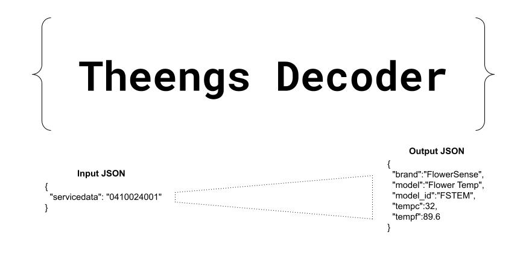

# Theengs BLE decoder

Theengs Decoder project aims to provide an efficient, portable and lightweight library for BLE Internet of Things messages decoding.

Sensors and devices use chains of data to communicate to gateways, computers, servers. Enabling them to have lightweight and fast communication.
On the other hand we have a huge diversity of communication methods, resulting in the sensors or devices being closed to one ecosystem or a few.

Theengs Decoder library translates these data chains into human readable data leveraging the well known data interchange format JSON. This format can easily be integrated into different systems or software.

It's also a simplified way of defining the thing properties and how to decode these.

Theengs Decoder supports the decoding of [more than 90 Bluetooth devices](https://decoder.theengs.io/devices/devices.html).

Theengs Decoder can be used on memory constraint environments like micro controllers (ESP32, ESP8266, Arduino), on a PC or on a Unix server.
Unit testing assures that the modification done on the library doesn't affect previous capabilities.

In a few words:
* Light
* Portable
* Expandable
* Interoperable

Projects using the Theengs Decoder library
* [OpenMQTTGateway](https://docs.openmqttgateway.com/) - A BLE to MQTT bridge running on ESP8266, ESP32 or Arduino boards.
* [Theengs Gateway](https://gateway.theengs.io/) - A Python-based BLE to MQTT bridge running on Raspberry Pi, Windows or Linux.
* [Theengs Explorer](https://github.com/theengs/explorer) - A text user interface to discover BLE devices, showing their raw advertisement alongside the decoded data; running on Linux, Windows or macOS.
* [Theengs App](https://app.theengs.io/) - A paid app for Android and iOS/iPadOS phones and tablets displaying decoded BLE sensor data and optionally acting as a BLE to MQTT bridge.
* [BresserWeatherSensorTTN](https://github.com/matthias-bs/BresserWeatherSensorTTN) - Bresser 5-in-1/6-in-1/7-in-1 868 MHz Weather Sensor Radio Receiver based on ESP32 and RFM95W/SX1276 - sends data to a LoRaWAN Network.
* [Platypush](https://github.com/BlackLight/platypush) - A versatile and extensible platform for home and life automation with hundreds of supported integrations.

::: warning Note
The material and information contained in this documentation is for general information purposes only. You should not rely upon the material or information on this documentation as a basis for making any business, legal or any other decisions. There is no warranty given on this documentation content. If you decide to follow the information and materials given it is at your own risk. I will not be liable for any false, inaccurate, inappropriate or incomplete information presented on this website.
:::
