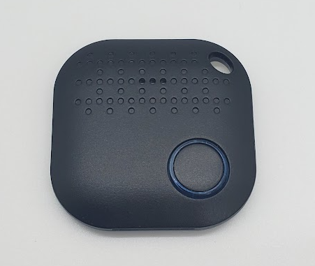

# BlueCharm Beacon 08/04P/021 - KKM K8/K4/K21

|Model Id|[KSensor](https://github.com/theengs/decoder/blob/development/src/devices/BC08_json.h)|
|-|-|
|Brand|BlueCharm/KKM|
|Model|Beacon 08/04P/021 - K8/K4/K21|
|Short Description|Water-Resistant (not the BC021/K21) MultiBeacon (KBeacon and iBeacon protocols supported)|
|Communication|BLE broadcast|
|Frequency|2.4Ghz|
|Power Source|CR2477|
|Exchanged Data|temperature, acceleration x/y/z-axis, voltage|
|Encrypted|No|
|Device Tracker|&#9989;|
|Image||
