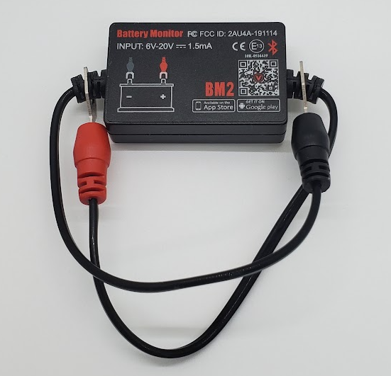

# BM2 Battery Monitor

|Model Id|[BM2](https://github.com/theengs/decoder/blob/development/src/devices/BM2_json.h)|
|-|-|
|Brand|GENERIC|
|Model|BM2 Battery Monitor|
|Short Description|Battery capacity|
|Communication|BLE broadcast|
|Frequency|2.4Ghz|
|Power Source|8V-16V or 6V-20V (depending on model)|
|Exchanged Data|battery|
|Encrypted|No|
|Presence Tracker|&#9989;|
|Image||
