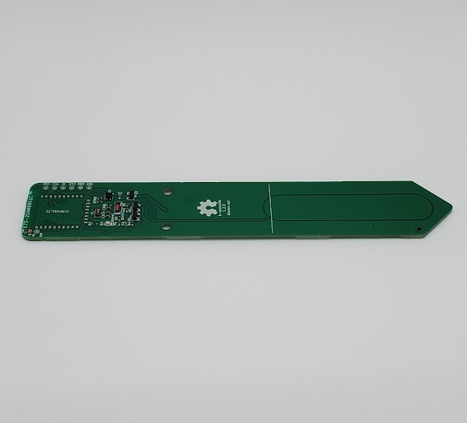

# rbaron b-parasite

|Model Id|[BPv1.0-1.2](https://github.com/theengs/decoder/blob/development/src/devices/BPARASITE_json.h)|
|-|-|
|Brand|rbaron|
|Model|b-parasite|
|Short Description|Open hardware and open source soil moisture and ambient temperature/humidity/light sensor https://github.com/rbaron/b-parasite|
|Communication|BLE broadcast|
|Frequency|2.4Ghz|
|Power source|CR2032|
|Exchanged data|moisture, temperature, humidity, luminance (v1.1.0+), voltage|
|Encrypted|No|
|Image||
