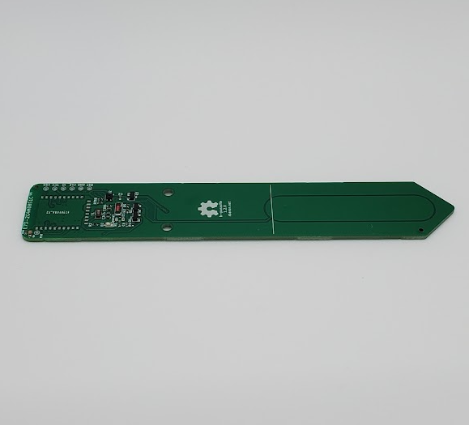

# rbaron b-parasite

|Model Id|[BPv1.0-2.0](https://github.com/theengs/decoder/blob/development/src/devices/BPARASITE_json.h)|
|-|-|
|Brand|rbaron|
|Model|b-parasite|
|Short Description|Open hardware and open source soil moisture and ambient temperature/humidity/light sensor|
|Communication|BLE broadcast|
|Frequency|2.4Ghz|
|Power Source|CR2032|
|Exchanged Data|temperature, humidity, moisture, luminance (v1.1.0+), battery (v2.0+), voltage|
|Encrypted|No|
|Image||
