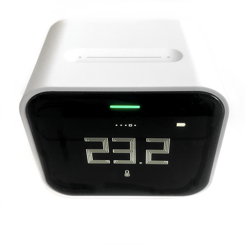

# Qingping Air Monitor Lite

|Model Id|[CGDN1](https://github.com/theengs/decoder/blob/development/src/devices/CGDN1_json.h)|
|-|-|
|Brand|Qingping|
|Model|Air Monitor Lite|
|Short Description|Air quality monitor|
|Communication|BLE broadcast|
|Frequency|2.4Ghz|
|Power Source|Rechargeable battery, USB-C|
|Exchanged Data|temperature, humidity, PM2.5, PM10, carbon dioxide|
|Encrypted|No - BLE broadcast only working after being paired with a companion app|
|Image||
