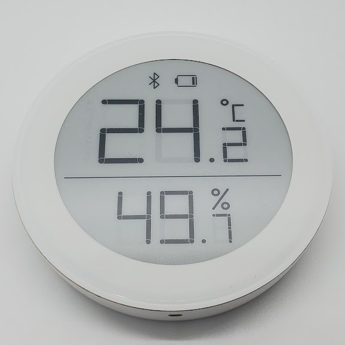

# ClearGrass/Qingping Hygro Thermometer CGG1

|Model Id|[CGG1](https://github.com/theengs/decoder/blob/development/src/devices/CGG1_json.h)|
|-|-|
|Brand|ClearGrass/Qingping|
|Model|Round Hygro Thermometer|
|Short Description|Simple temperature and humidity sensor with e-ink display|
|Communication|BLE broadcast|
|Frequency|2.4Ghz|
|Power Source|CR2430|
|Exchanged Data|temperature, humidity, battery, voltage (depending on which CGG1 firmware is installed)|
|Encrypted|No|
|Image||
