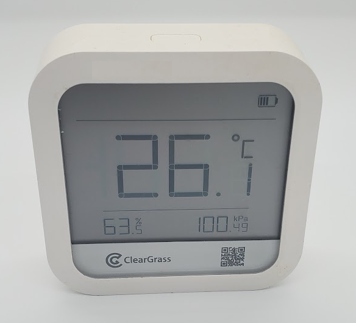

# ClearGrass Weather Station CGP1W

|Model Id|[CGP1W](https://github.com/theengs/decoder/blob/development/src/devices/CGP1W_json.h)|
|-|-|
|Brand|ClearGrass|
|Model|Weather Station|
|Short Description|Rechargeable temperature, humidity and atmospheric pressure sensor|
|Communication|BLE broadcast|
|Frequency|2.4Ghz|
|Power Source|Internal battery/USB|
|Exchanged Data|temperature, humidity, atmospheric pressure|
|Encrypted|No|
|Image||
