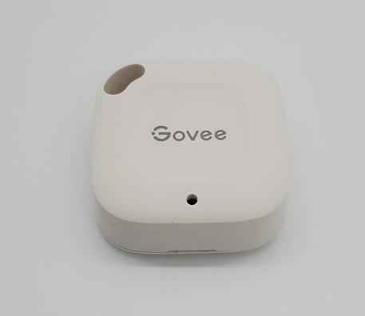

# Govee H5074

|Model Id|[H5074](https://github.com/theengs/decoder/blob/development/src/devices/H5074_json.h)|
|-|-|
|Brand|Govee|
|Model|Smart Thermo Hygrometer|
|Short Description|Indoor Digital Humidity and Temperature monitor|
|Communication|BLE broadcast|
|Frequency|2.4Ghz|
|Power Source|2 CR2477|
|Exchanged Data|temperature, humidity, battery|
|Encrypted|No|
|Image||
