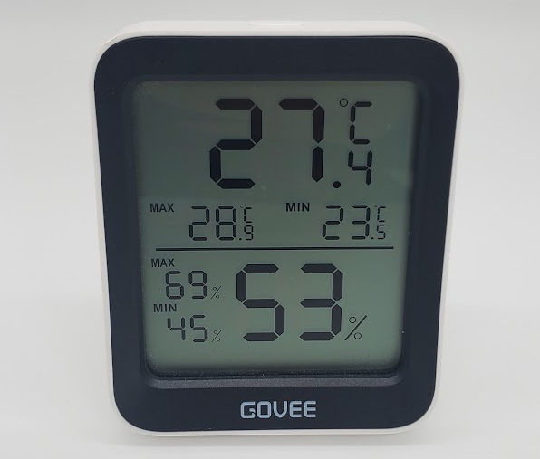

# Govee H5075

|Model Id|[H5075](https://github.com/theengs/decoder/blob/development/src/devices/H5072_json.h)|
|-|-|
|Brand|Govee|
|Model|Thermo-Hygrometer|
|Short Description|Indoor digital temperature and humidity monitor with large LCD display|
|Communication|BLE broadcast|
|Frequency|2.4Ghz|
|Power Source|2 AAA|
|Exchanged Data|temperature, humidity, battery|
|Encrypted|No|
|Image||
