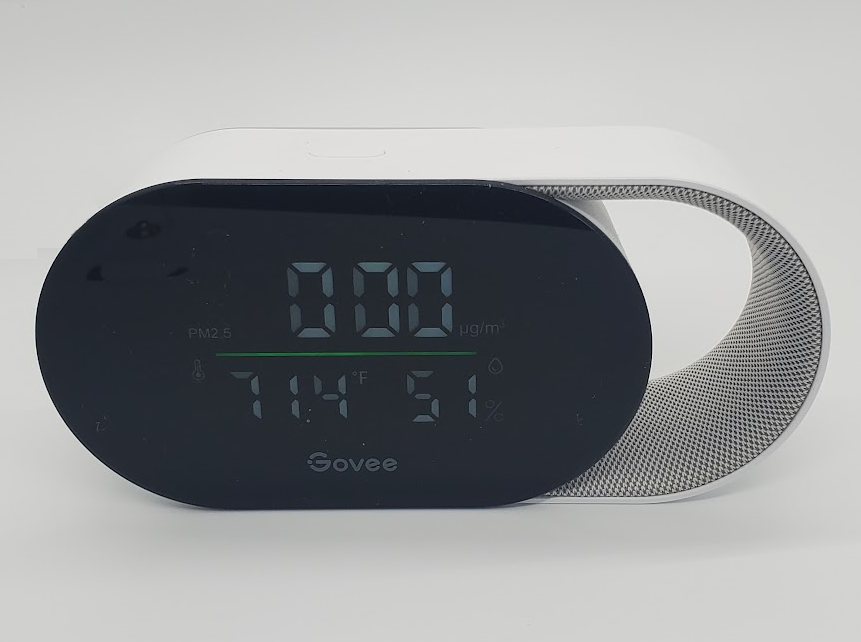

# Govee H5106

|Model Id|[H5106](https://github.com/theengs/decoder/blob/development/src/devices/H5106_json.h)|
|-|-|
|Brand|Govee|
|Model|Smart Air Quality Monitor|
|Short Description|Air quality monitor with temperature, humidity and PM2.5|
|Communication|BLE broadcast|
|Frequency|2.4Ghz|
|Power Source|USB-C|
|Exchanged Data|temperature, humidity, PM2.5|
|Encrypted|No|
|Image||
