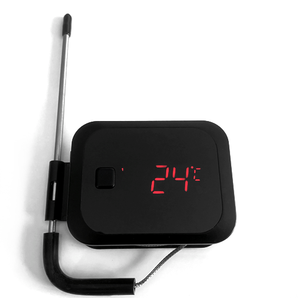

# Inkbird 2X(S) BBQ

|Model Id|[IBT_2X(S)](https://github.com/theengs/decoder/blob/development/src/devices/IBT_2X_json.h)|
|-|-|
|Brand|Inkbird|
|Model|BBQ Temperature sensor|
|Short Description|BBQ Temperature sensor with 2 probes|
|Communication|BLE broadcast|
|Frequency|2.4Ghz|
|Power Source|2 AAA (Rechargeable battery, USB)|
|Exchanged Data|temperature, temperature2|
|Encrypted|No|
|Image||
