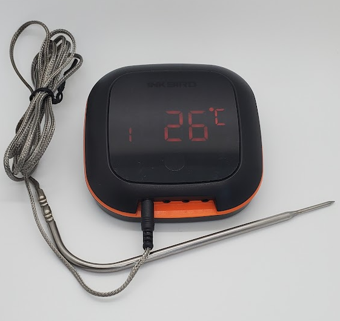

# Inkbird 4X(S/C) BBQ

|Model Id|[IBT_4X(S/C)](https://github.com/theengs/decoder/blob/development/src/devices/IBT_4XS_json.h)|
|-|-|
|Brand|Inkbird|
|Model|BBQ Temperature sensor|
|Short Description|BBQ Temperature sensor with 4 probes|
|Communication|BLE broadcast|
|Frequency|2.4Ghz|
|Power Source|Rechargeable battery, USB|
|Exchanged Data|temperature, temperature2, temperature3, temperature4|
|Encrypted|No|
|Image||
