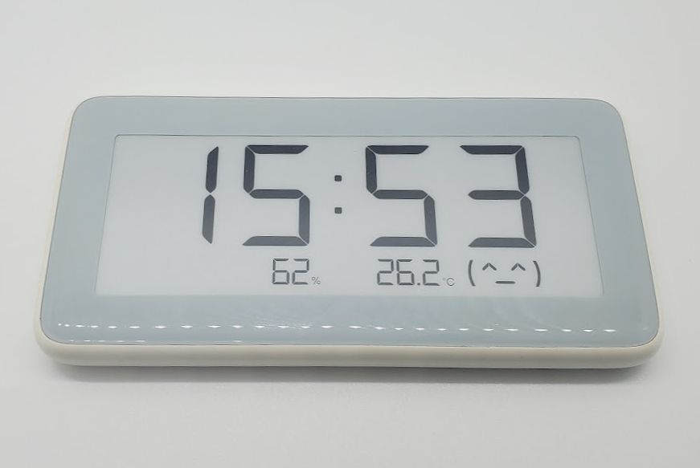

# Xiaomi/Mijia LYWSD02 e-ink Clock

|Model Id|[LYWSD02](https://github.com/theengs/decoder/blob/development/src/devices/LYWSD02_json.h)|
|-|-|
|Brand|Xiaomi/Mijia|
|Model|e-ink Clock|
|Short Description|Rectangular clock with e-ink display and temperature/humidity measurement|
|Communication|BLE broadcast|
|Frequency|2.4Ghz|
|Power Source|2 CR2032|
|Exchanged Data|temperature, humidity, battery|
|Encrypted|No|
|Image||
