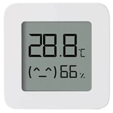

# Xiaomi LYWSD03MMC ATC or PVVX firmware

|Model Id|[LYWSD03MMC_ATC/PVVX](https://github.com/theengs/decoder/blob/development/src/devices/LYWSD03MMC_json.h)|
|-|-|
|Brand|Xiaomi|
|Model|Compact Temperature sensor|
|Short Description|Temperature and humidity sensor compact and cost effective with ATC or PVVX firmware|
|Communication|BLE broadcast|
|Frequency|2.4Ghz|
|Power Source|CR2032|
|Exchanged Data|temperature, humidity, battery, voltage (depending on which LYWSD03MMC firmware is installed)|
|Encrypted|Yes/No - Optional|
|Image||
