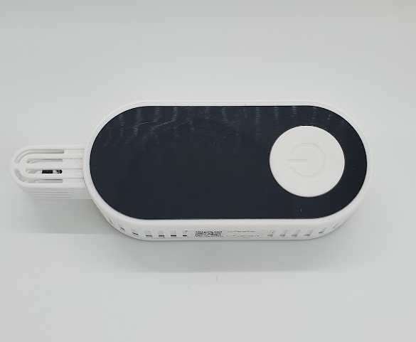

# MokoSmart Pro

|Model Id|[MBXPRO](https://github.com/theengs/decoder/blob/development/src/devices/MBXPRO_json.h)|
|-|-|
|Brand|MOKOSMART|
|Model|H4|
|Short Description|IP66 Waterproof temperature and humidity sensor with accelerometer|
|Communication|BLE broadcast|
|Frequency|2.4Ghz|
|Power Source|2 AAA|
|Exchanged Data|temperature, humidity, acceleration x/y/z-axis, volt|
|Encrypted|No|
|Presence Tracker|&#9989;|
|Image||
