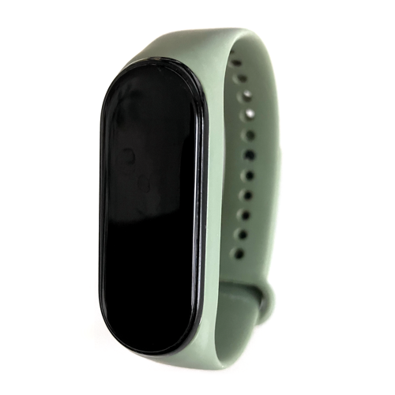

# Xiaomi Mi Band

|Model Id|[MiBand](https://github.com/theengs/decoder/blob/development/src/devices/Miband_json.h)|
|-|-|
|Brand|Xiaomi|
|Model|Mi Band|
|Short Description|Fitness band with step count and activity heart rate monitoring|
|Communication|BLE broadcast|
|Frequency|2.4Ghz|
|Power Source|Rechargeable battery|
|Exchanged Data|steps, activity heart rate (when activated in the Zepp Life settings)|
|Encrypted|No|
|Device Tracker|&#9989;|
|Image||
