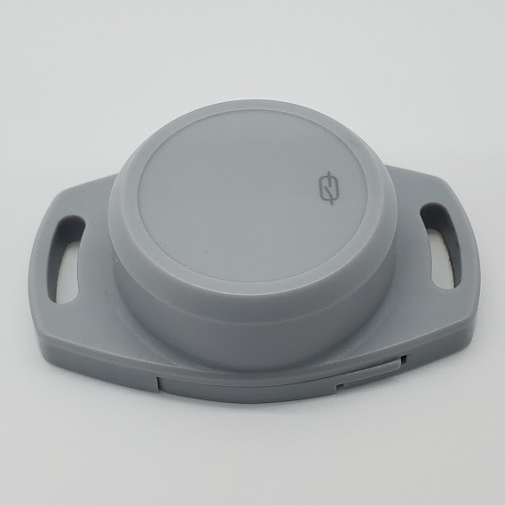

# MokoSmart Beacon

|Model Id|[MokoBeacon](https://github.com/theengs/decoder/blob/development/src/devices/Mokobeacon_json.h)|
|-|-|
|Brand|MOKOSMART|
|Model|Beacon|
|Short Description|MokoBeacon protocol|
|Communication|BLE broadcast|
|Frequency|2.4Ghz|
|Power Source|CR2032|
|Exchanged Data|acceleration x/y/z-axis, battery|
|Encrypted|No|
|Presence Tracker|&#9989;|
|Image||
