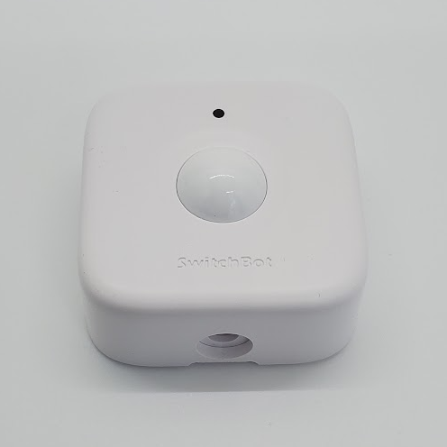

# SwitchBot Motion Sensor

|Model Id|[W110150X](https://github.com/theengs/decoder/blob/development/src/devices/SBMS_json.h)|
|-|-|
|Brand|SwitchBot|
|Model|Motion Sensor|
|Short Description|PIR Motion Sensor|
|Communication|BLE broadcast|
|Frequency|2.4Ghz|
|Power Source|2 AAA|
|Exchanged Data|motion, light level, sensing distance, led, scope tested, battery|
|Encrypted|No|
|Image||
