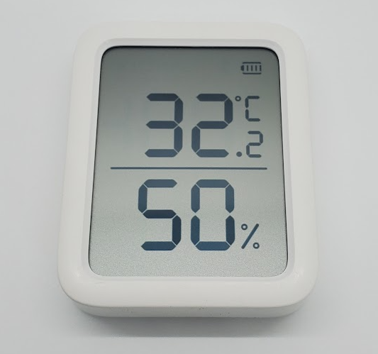

# SwitchBot Meter (Plus)

|Model Id|[THX1(W230150X)](https://github.com/theengs/decoder/blob/development/src/devices/SBMT_json.h)|
|-|-|
|Brand|SwitchBot|
|Model|Meter (Plus)|
|Short Description|Thermometer and Hygrometer|
|Communication|BLE broadcast|
|Frequency|2.4Ghz|
|Power source|2 AAA|
|Exchanged data|temperature, humidity, battery|
|Encrypted|No|
|Image||