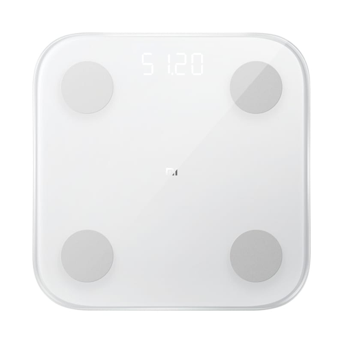

# Xiaomi Mi Body Composition Scale

|Model Id|[XMTZC02HM/XMTZC05HM](https://github.com/theengs/decoder/blob/development/src/devices/XMTZC05HM_json.h)|
|-|-|
|Brand|Xiaomi|
|Model|Mi Body Composition Scale|
|Short Description|First (MIBCS) and second (MIBFS) version of the Mi Body Composition Scale|
|Communication|BLE broadcast|
|Frequency|2.4Ghz|
|Power Source|4 AAA|
|Exchanged Data|weighing_mode, unit, weight, impedance|
|Encrypted|No|
|Image||
